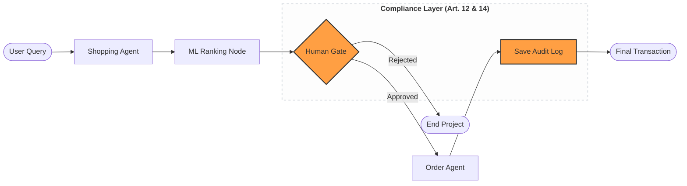

# Multi-Agent Audit POC: EU AI Act Compliance Framework

**An enterprise-grade, EU AI Act-compliant multi-agent system that utilizes deterministic state machines and hybrid ML-ranking to provide auditable, human-in-the-loop product recommendations.**

---

## Project Architecture

This system demonstrates a robust architectural response to the regulatory demands of the EU AI Act (Articles 12 & 14). By utilizing **LangGraph**, we replace autonomous "black-box" behavior with a predictable state machine.



---

## Key Features

* **Deterministic Orchestration:** Built with LangGraph to ensure the AI follows a strictly defined path.
* **Hybrid Intelligence:** LLMs handle the search, but a **Scikit-learn** ML model handles objective ranking to prevent model bias.
* **Human-in-the-Loop (Art. 14):** A mandatory "Human Gate" that prevents orders from being processed without manual approval.
* **Traceable Audit Logs (Art. 12):** Every decision is recorded in an immutable JSON trail for regulatory review.
* **Automated Guardrail Testing:** Pytest suite to programmatically verify compliance constraints.

---

## Setup & Installation

1. **Set Local Python Version:**
   ```bash
   pyenv local 3.12.11
   ```

2. **Initialize Environment:**
   ```bash
   python -m venv .venv
   source .venv/bin/activate
   pip install -r requirements.txt
   ```

3. **Run Compliance Tests:**
   ```bash
   python -m pytest tests/compliance_test.py
   ```

---

## Regulatory Alignment

| Article | Requirement | Implementation |
| :--- | :--- | :--- |
| **Art. 12** | Record-keeping | `src/utils/logger.py` generates persistent JSON audit trails. |
| **Art. 14** | Human Oversight | LangGraph `interrupt_before` ensures a human must set `is_approved`. |
| **Art. 13** | Transparency | ML Ranking node provides objective, explainable scoring criteria. |

